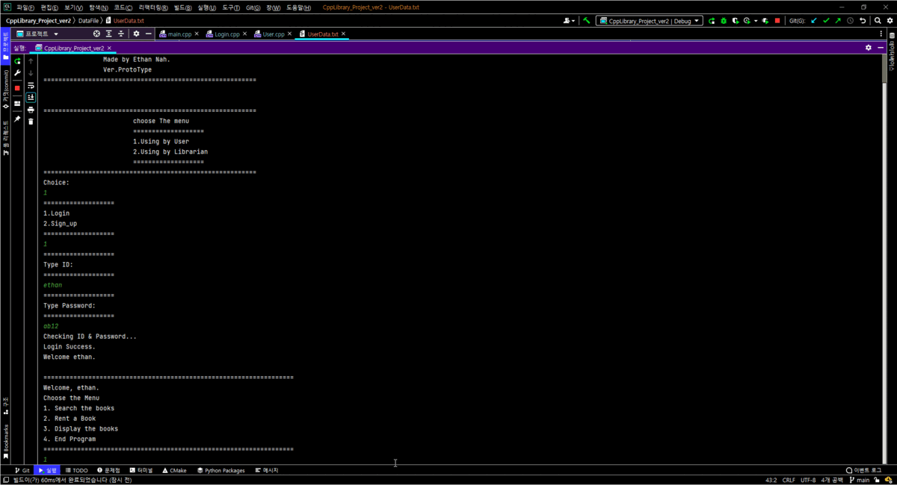

# Library Management Project
## About Project
#### Mini Projects written in C++
-----------
### Main Functions
1. Search
2. Rent
3. Add Data
4. Update Data

----------
### Data Management
File I/O

-----
### Code Detail as an example   
* Searching in Data 
```swift
ifstream MyFile("DataFile/BookData.txt");
        while (!MyFile.eof()) {
            getline(MyFile, line);
            string found = line.substr(0, line.find(delim));
            if (found == searchbook) {
                inputbookname.open("DataFile/Temp.txt", ios::out);
                inputbookname << line << endl;
                count++;
            }
```   
   

* Update Data
```swift
while (!Myfile.eof()) {
                getline(Myfile, line);
                found = line.substr(0, line.find(delim));
                if (found == bookid) {

                    line.erase(0, line.find(delim) + 1);
                    cout << "TYPE NUMBOOKS: " << endl;
                    cin >> changenumval;
                    found1 = line.substr(0,line.find(delim));
                    line.erase(0,line.length()-line.find(delim));

                    cout << "change number of books : " << changenumval << endl;
                    cout << "Full Change : " << found +"\t"+found1+"\t"+changenumval << endl;
                    Newfile << found +"\t"+found1+"\t"+changenumval<<endl;
                } else {
                    Newfile << line << endl;
                }

            }
```   
   
            
--------------

### Thank You


[//]: # (These are reference links used in the body of this note and get stripped out when the markdown processor does its job. There is no need to format nicely because it shouldn't be seen. Thanks SO - http://stackoverflow.com/questions/4823468/store-comments-in-markdown-syntax)

   [dill]: <https://github.com/joemccann/dillinger>
   [git-repo-url]: <https://github.com/joemccann/dillinger.git>
   [john gruber]: <http://daringfireball.net>
   [df1]: <http://daringfireball.net/projects/markdown/>
   [markdown-it]: <https://github.com/markdown-it/markdown-it>
   [Ace Editor]: <http://ace.ajax.org>
   [node.js]: <http://nodejs.org>
   [Twitter Bootstrap]: <http://twitter.github.com/bootstrap/>
   [jQuery]: <http://jquery.com>
   [@tjholowaychuk]: <http://twitter.com/tjholowaychuk>
   [express]: <http://expressjs.com>
   [AngularJS]: <http://angularjs.org>
   [Gulp]: <http://gulpjs.com>

   [PlDb]: <https://github.com/joemccann/dillinger/tree/master/plugins/dropbox/README.md>
   [PlGh]: <https://github.com/joemccann/dillinger/tree/master/plugins/github/README.md>
   [PlGd]: <https://github.com/joemccann/dillinger/tree/master/plugins/googledrive/README.md>
   [PlOd]: <https://github.com/joemccann/dillinger/tree/master/plugins/onedrive/README.md>
   [PlMe]: <https://github.com/joemccann/dillinger/tree/master/plugins/medium/README.md>
   [PlGa]: <https://github.com/RahulHP/dillinger/blob/master/plugins/googleanalytics/README.md>


